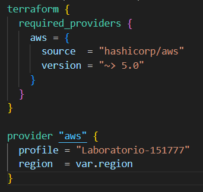
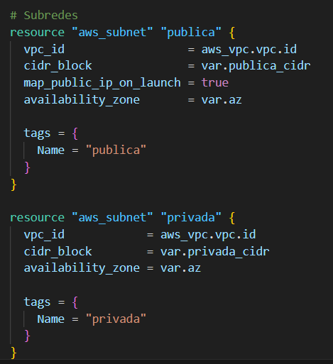
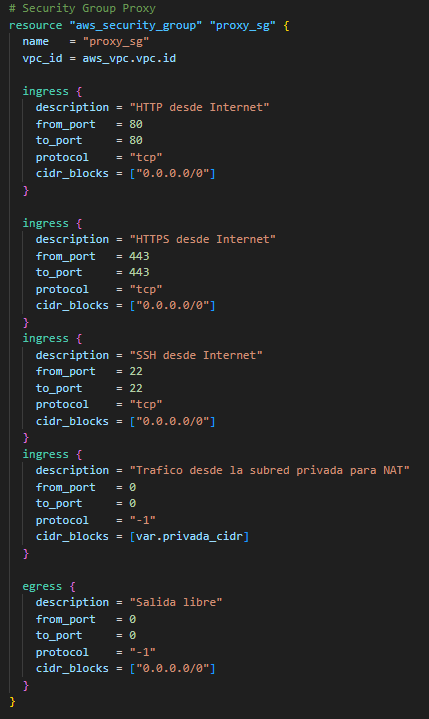
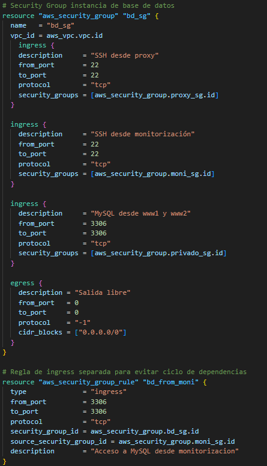
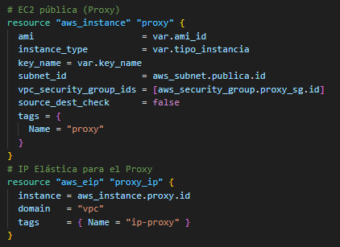
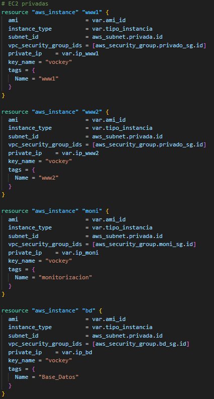
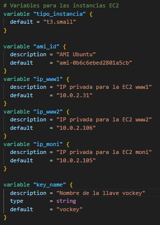
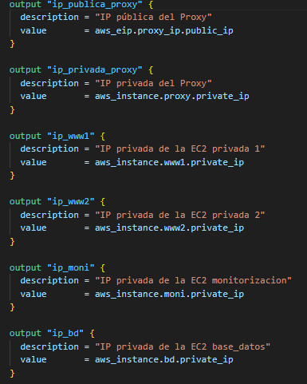

# Implementación de la infraestructura mediante Terraform
Se ha utilizado terraform para crear la gran mayoría de la infraestructura. Los elementos de la infraestructura que se han creado con terraform han sido la VPC (Destilería Valles), las dos subredes (pública y privada), las 3 instancias EC2(Proxy, www1 y www2), los grupos de seguridad, el internet gateway y las tablas de enrutamiento.   

Para hacer la implementación más sencilla se han utilizado cuatro archivos que contienen diferente información los cuales son el archivo main.tf (creación de la infraestructura), el archivo providers (información de conexión), el archivo variables.tf (variables utilizadas para facilitar la creación) y el archivo outputs.tf (saca por consola datos relevantes de las instancias). 
## Providers.tf 
Este archivo está dividido en dos bloques los cuales son el primero donde se establecen los requisitos técnicos que debe cumplir terraform y el segundo en el que se configuran los detalles de la cuenta y de la ubicación de los servidores.
  

## Main.tf 

Main.tf está dividido en una serie de bloques según el recurso que creen.  
### VPC
El primer bloque que se observa es el utilizado para crear la VPC donde se define mediante una variable el bloque CIDR y se le proporciona un nombre descriptivo a la VPC utilizando el parámetro tag. 

  
### Subredes
El segundo bloque se usa para crear las subredes para lo cual mediante variables se les asigna la VPC de la que deben ser parte y se les indica cuál va a ser su bloque CIDR y su zona de disponibilidad. La subred pública tendrá el siguiente map_public_ip_on_launch = true que indica que a las instancias de esta subred se les asignará una ip publica automáticamente.  

### Internet gateway y tablas de rutas
A continuación, se encuentra el bloque que crea el internet gateway que le proporcionará a internet a las instancias de la subred pública y las tablas de rutas.     

Se han creado dos tablas de rutas (una pública y otra privada). La tabla de rutas pública tiene una serie de parámetros que indican que todo el tráfico que no sea interno (0.0.0.0/0) pase por el internet gateway hacia internet.    

La tabla de rutas privada permite que todo el tráfico que deba enviarse a internet pase por el proxy previamente el cual cumplirá la función de instancia nat proporcionando el internet a las instancias la subred privada.   

  
### Grupos de seguridad
Otro bloque importante es el que se encarga de crear los grupos de seguridad que en este caso serán tres (uno para el proxy, otro para las instancias privadas ww1 y www2, la instancia monitorización y la instancia para la base de datos). El grupo de seguridad del proxy permitirá la entrada por el puerto 80(HTTP) y el puerto 443(HTTPS) para permitir la entrada de las peticiones a la página web, permitirá la entrada por el puerto 22 (SSH) para permitir la gestión del proxy y permitirá también la entrada desde cualquier instancia de la subred privada para que pueda cumplir la función de instancia nat, además permitirá la salida de todo tipo de protocolos para que el proxy puedo consultar internet o las máquinas internas.

El grupo de seguridad de las instancias privadas www1 y www2 permitirá el tráfico de entrada de HTTP (80) y HTTPS (443) desde el proxy para recibir las peticiones, el tráfico ssh desde el proxy para permitir la gestión de mantenimiento de las instancias y el tráfico ssh desde la instancia de monitorización. Además, este grupo de seguridad permitirá la salida de todo tipo de protocolos.

El grupo de seguridad para la instancia de monitorización permitirá el ssh desde el proxy para poderla modificar o actualizar, también permitirá la entrada de todas las métricas necesarias para que cumpla su función, además permitirá la salida de todos los protocolos. En este caso una de las reglas ingress esta separada del resto debido a que si no habría problemas de dependencia con la base de datos.

El grupo de seguridad para la instancia de la base de datos permitirá el ssh desde el proxy para poderla modificar o actualizar, también permitirá la entrada de todas las métricas necesarias para poder conectarse con www1 y www2 y el equipo de monitorización, además permitirá la salida de todos los protocolos. En este caso una de las reglas ingress está separada del resto debido a que si no habría problemas de dependencia con la instancia encargada de la monitorización.

### Instancias
El último bloque está relacionado con la creación de las instancias. Dentro del último bloque podemos ver dos partes las cuales son la primera en la que se crea la instancia proxy con una serie de características como el ami, la subred a la que pertenece o el grupo de Seguridad que le han sido proporcionados mediante variables, además se le ha asignado una IP elástica para que su ip cambie con el tiempo. Para poderme conectar a ella por SSH he utilizado un parámetro con una variable cuyo valor es el nombre de la clave key.
Para que esta máquina pueda funcionar además de instancia nat le he añadido el parámetro source_dest_check = false para permitir que el proxy deje pasar el tráfico desde las instancias de la subred privada. 

En la segunda parte del último bloque se puede ver cómo se han creado las instancias privadas(ww1, ww2, monitorización y Base_Datos) a las que los parámetros de la ami, el tipo de instancia, el grupo de seguridad asignado o la subred a la que pertenecen se les ha asignado mediante variables. Para conseguir que las IPs que tienen sean estáticas y no varíen se les ha asignado el siguiente parámetro private_ip    = var.ip_nombre.
 
## Variables.tf
En este archivo se han definido todas las variables utilizadas a lo largo del archivo main.
Algunas de las variables han sido la variable región donde se indica la región en la que se encuentra la infraestructura que en este caso será la us-east-1 o la variable az que indica en que zona de disponibilidad se encuentra la infraestructura Que en este caso será us-east-1ª.

Se han utilizado una serie de variables para asignar los bloques CIDR a la VPC y a las subredes los cuales son vpc_cidr para asignar el bloque CIDR a la VPC(10.0.0.0/16), publica_cidr para asignar el bloque CIDR a la subred pública (10.0.1.0/24) y privada_cidr para asignar el bloque CIDR a la subred privada (10.0.2.0.0/24). 

Otras variables utilizadas están relacionadas con la creación de las instancias. Entre estas destacan la variable tipo_instancia que indica qué tipo de instancia se va a crear (t3.small), la variable ami_id que indica la ami para Ubuntu(ami-0b6c6ebed2801a5cb) ya que todas las máquinas utilizadas eran Ubuntu, las variables ip_www1, ip_www2 y ip_moni que indican la ip fija que tendrán las tres instancias privadas (www1-10.0.2.31, www2-10.0.2.106, monitorizacion-10.0.2.105 y Base_Datos-10.0.2.110) y la variable key name donde se indica el nombre de la clave vokey que es esencial para hacer ssh.

## Outputs.tf
En este archivo se indica que se deberá sacar por pantalla al terminar el terraform apply las IP de las instancias. Concretamente se proporcionará la IP pública y privada del proxy y la IP privadas de www1, www2, monitorización y Base_Datos.

 

 

 

 

 
 

 